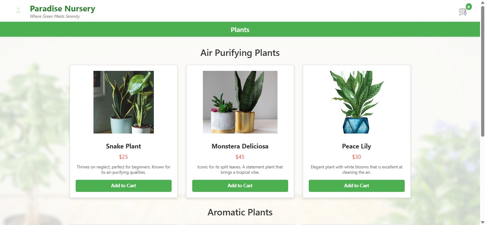
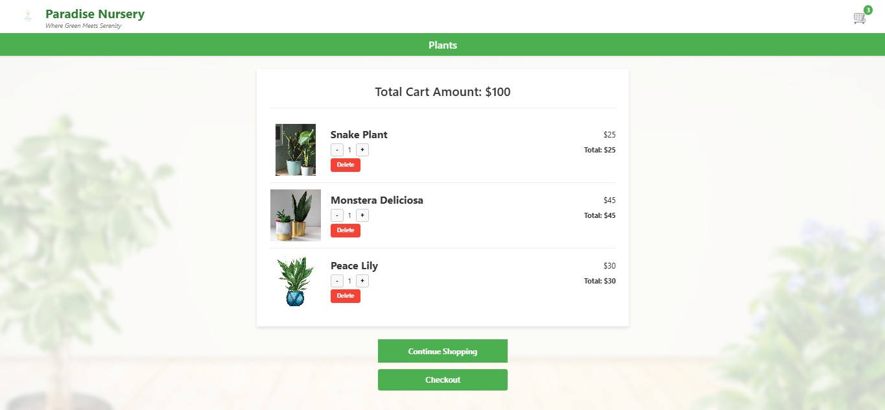

# Paradise Nursery - A React Shopping Cart Application

 <!-- Make sure to add this screenshot to your public folder -->

A fully responsive front-end e-commerce application for a fictional plant nursery, meticulously designed to match specific UI/UX mockups. This project allows users to browse a beautiful selection of house plants, add them to a dynamic shopping cart, and manage cart items before checkout. Built with modern web technologies including React, Vite, and Redux Toolkit.

**Live Demo:** [**https://213020aumc.github.io/paradise-nursery/**](https://213020aumc.github.io/paradise-nursery/)

---

## 🌟 Key Features

- **Pixel-Perfect Design:** UI/UX built to match professional design specifications.
- **Engaging Landing Page:** A two-column welcome page that introduces the brand.
- **Categorized Product Listing:** Browse products grouped by categories (e.g., "Air Purifying") with sale indicators.
- **Dynamic Shopping Cart:**
  - Add products to the cart directly from the product list.
  - View all items in a cleanly designed cart page.
  - Increase, decrease, or remove items with real-time total calculation.
- **Global State Management:** Uses Redux Toolkit for a centralized and predictable state, ensuring the cart count and totals are always in sync across the app.
- **Client-Side Routing:** Seamless navigation between the landing, product, and cart pages using React Router.
- **Responsive & Modern UI:** A clean and functional interface that adapts to different screen sizes.

---

## 💻 Technologies Used

- **React:** For building the user interface with a component-based architecture.
- **Vite:** A next-generation frontend tooling for an extremely fast development experience.
- **Redux Toolkit:** For robust and efficient global state management.
- **React Router:** For handling all client-side routing.
- **CSS3:** For custom styling, layout, and responsive design.

---

## 🖼️ Screenshots

| Landing Page                                     | Product Listing                                   | Shopping Cart                              |
| ------------------------------------------------ | ------------------------------------------------- | ------------------------------------------ |
|  |  |  |

---

## 🚀 Getting Started

To get a local copy up and running, follow these simple steps.

### Prerequisites

Make sure you have Node.js and npm installed on your machine.

- Node.js (v22 or later recommended)
- npm

### Installation & Setup

1.  **Clone the repository:**

    ```sh
    git clone https://github.com/213020aumc/paradise-nursery.git
    ```

2.  **Navigate to the project directory:**

    ```sh
    cd paradise-nursery
    ```

3.  **Install NPM packages:**

    ```sh
    npm install
    ```

4.  **Run the development server:**
    The application will be available at `http://localhost:5173/`.
    ```sh
    npm run dev
    ```

---

## 🌐 Deployment with Vite

This project is configured for easy deployment to GitHub Pages.

1.  **Configure `vite.config.js`:**
    Set the `base` property in your `vite.config.js` file to your repository name. This is crucial for GitHub Pages to find your assets correctly.

    ```javascript
    // vite.config.js
    import { defineConfig } from "vite";
    import react from "@vitejs/plugin-react";

    export default defineConfig({
      plugins: [react()],
      base: "/paradise-nursery/",
    });
    ```

2.  **Install `gh-pages`:**

    ```sh
    npm install gh-pages --save-dev
    ```

3.  **Add deploy scripts to `package.json`:**
    Vite builds the project into a `dist` folder. The deploy script needs to target this folder.

    ```json
    {
      "name": "paradise-nursery",
      "homepage": "https://213020aumc.github.io/paradise-nursery",
      // ...
      "scripts": {
        "dev": "vite",
        "build": "vite build",
        "preview": "vite preview",
        "predeploy": "npm run build",
        "deploy": "gh-pages -d dist"
      }
      // ...
    }
    ```

4.  **Deploy the application:**
    This command will build your project and push the `dist` folder to a `gh-pages` branch on your repository.
    ```sh
    npm run deploy
    ```
    Your site will be live at the `homepage` URL in your `package.json`.

---

## 👤 Author & Contact

Feel free to connect with me!

- **GitHub:** [@213020aumc](https://github.com/213020aumc)
- **LinkedIn:** [Muhammad Fraz](https://www.linkedin.com/in/muhammad-fraz-298900247)
